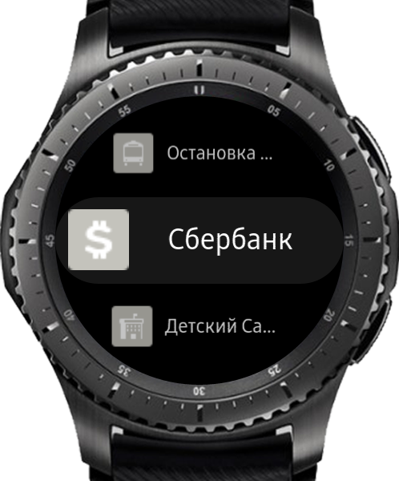
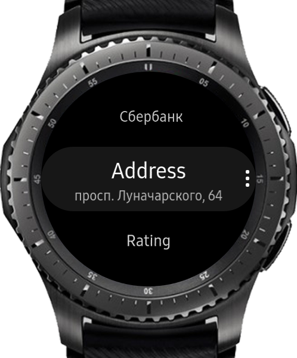
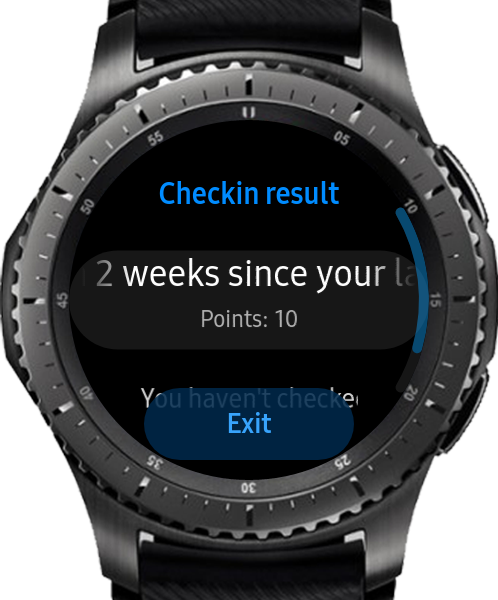

# SquareGear
## Fastest way to meet up with you friends with FourSquare!

Features:
* List nearby places
* Detailed information about venue
* Ability to call number of venue right on Gear
* Tips list
* Ability to open venue's link directly on watch (only for Gear S) and on phone
* Checkin places you've been
* Mention friends with you
* Checkin result (tap for full message)
* Swipe left for checkin
* Stand-alone for compatible watch (with GPS)

P.S. Powered by FourSquare

[Phone part can be found here](https://github.com/RumataEstorish/GearHub)
